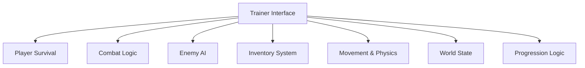

## Overview

The Midnight Walkers Trainer is a runtime gameplay control utility designed to interface with the survival horror systems of **The Midnight Walkers**. The trainer exposes configurable layers for player vitality, stamina flow, combat resolution, enemy AI behavior, inventory logic, and environmental triggers. Operating through non-destructive runtime hooks, it applies real-time overrides to internal calculations governing danger, scarcity, and encounter pacing without altering core game files. Secondary keywords integrated include survival trainer, stat controller, enemy behavior modifier, and resource management toolkit.

---

## Player Vitality and Survival Control

* Health and stamina lock
* Damage immunity and scaling
* Regeneration rate adjustment
* Fear and stress suppression

**Feature intent:**
Overrides survival-state calculations to stabilize player condition during high-pressure encounters.

---

## Combat and Weapon Mechanics Control

* Damage output multiplier
* Reload and cooldown bypass
* Accuracy and recoil adjustment
* Ammo consumption override

**In-game behavior:**
Modifies combat resolution logic while preserving weapon acquisition and progression systems.

---

## Enemy AI and Threat Regulation

* Enemy freeze and speed scaling
* Aggression radius tuning
* Detection and chase delay control
* Attack cooldown manipulation

**Feature intent:**
Alters enemy update loops to regulate threat intensity and encounter frequency.

---

## Resource and Inventory Management

* Unlimited consumable usage
* Item quantity adjustment
* Crafting requirement bypass
* Key item usage override

**In-game behavior:**
Intercepts inventory validation checks tied to scarcity-driven survival mechanics.

---

## Movement, Stamina, and Physics Overrides

* Movement speed multiplier
* Sprint and dodge stamina bypass
* Fall damage disable
* Collision and navigation tuning

**Feature intent:**
Applies physics-layer overrides to traversal and endurance-based movement systems.

---

## World State and Environment Control

* Visibility and darkness adjustment
* Hazard trigger suppression
* Scripted event condition bypass
* Interactive object range expansion

**In-game behavior:**
Manages environmental variables that influence tension, navigation, and scripted encounters.

---

## Progression and Unlock Management

* Instant ability unlocks
* Upgrade requirement bypass
* Checkpoint and save trigger control
* Narrative gate override

**Feature intent:**
Alters progression validation logic governing unlocks and story advancement.

---

## Trainer Interface and Runtime Management

* Categorized trainer modules
* Toggle-based real-time activation
* Adjustable value sliders
* Session-scoped configuration

**Feature intent:**
Acts as the central coordination layer, synchronizing all trainer systems dynamically during gameplay.

---

## System Architecture Diagram

---

## FAQ

**Does the trainer permanently modify game files?**
No, all features operate through runtime systems only.

**Can enemy and player systems be controlled independently?**
Yes, each module functions separately and can be toggled at any time.

**Are changes applied instantly?**
Most adjustments take effect in real time.

**Does it remove survival horror mechanics entirely?**
Intensity can be regulated, but systems remain active unless explicitly disabled.

**Can progression changes be reversed?**
Disabling progression modules restores default behavior.

**Is configuration saved between sessions?**
Settings apply per active session.

---

## Feature Summary

* Player vitality and survival control
* Combat and weapon mechanics control
* Enemy AI and threat regulation
* Resource and inventory management
* Movement, stamina, and physics overrides
* World state and environment control
* Progression and unlock management
* Centralized The Midnight Walkers trainer interface
